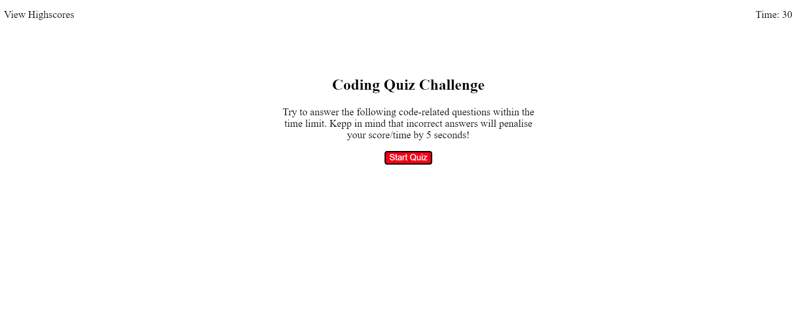

# homework-wk4
Submission for the Homework for Week 4 (Code Quiz)


Making page:
```
    made all the HTML based off of the example gif
    added eventlisteners to be able to skip through each of the sections
```

Making quiz:
```
    made 5 sets of questions and answers
    put them into an object
```

Displaying quiz:
```
    looped through the quiz object to push to screen 
    made the right question appear with the right answer and then was able to 
        seperate all of them to have their own screen
```

Timer:
```
    added timer
    timer updates every time it ticks, each second
    once completed timer is stopped and the time is recorded as the score
```

Submit score:
```
    put initals and score into an object
    put the object into a highscores array
    added array of objects to localStorage using JSON
```

Highscores:
```
    made highscore screen available from any screen as seen in example using the "View Highscores" text
    sort all the highscores in descending order
    pushing scores from localStorage to screen to show the best score at the top and the worst at the bottom
    made two buttons, one to go back to the start screen and one to clear the highscores
```

Other:
```
    added css styling
    added comments 
    made README.md
```



GitHub Pages: https://djtoohey.github.io/homework-wk4/index.html
